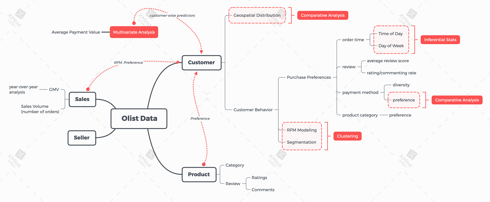

# Customer-Analysis-Based-On-Olist
Olist is a Brazilian e-commerce platform that connects small and medium-sized businesses to customers across Brazil. The platform operates as a marketplace, where merchants can list their products and services and customers can browse and purchase them online. Olist has rich e-commerce operational data, providing details at each stage of e-commerce sales.   

## Data Source
Kaggle: https://www.kaggle.com/datasets/olistbr/brazilian-ecommerce  
The data was provided by Olist, containing multiple datasets that can be joined on certain keys. The schema is shown below:  

## Objective

The motivation behind choosing this particular topic stems from the recognition of customers as the lifeblood of any e-commerce platform. In today's highly competitive digital marketplace, understanding customer behavior and value is vital and paramount. We were particularly drawn to the challenge of unlocking the potential within customer data, mainly in three aspects:  
* Customer EDA: By exploring and understanding the underlying patterns in customer behaviors, we can provide a general overview of the Olist e-commerce data and uncover areas of improvement within the platform, primarily based on customer geolocation distribution and customer purchase preference.  
* Customer Segmentation: By segmenting customers into meaningful groups based on their transactional behavior, we can enable targeted marketing efforts and more efficient allocation of resources, improving personalized customer experience. 

 

To sum up, this project is driven by the desire to derive data-driven solutions that enable the e-commerce platform to not only survive but thrive in the competitive landscape. Through this analysis, we hope to contribute to the development of a more customer-centered platform that values and leverages the power of its customer data to drive decisions and strategies.  

